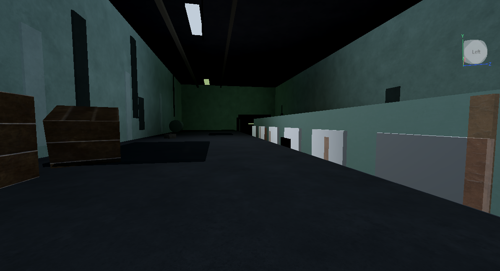
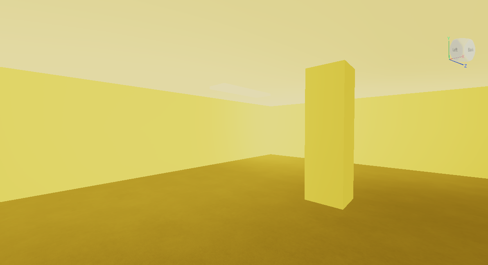
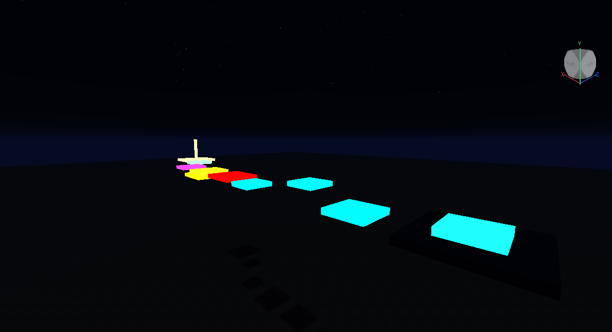
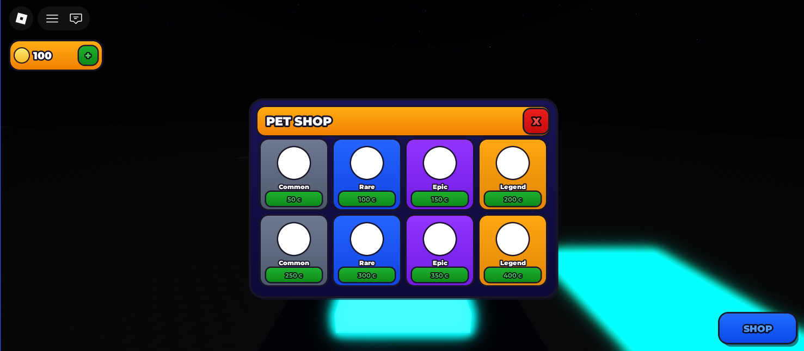
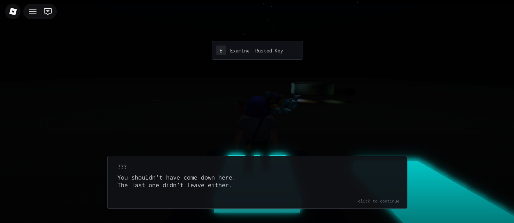
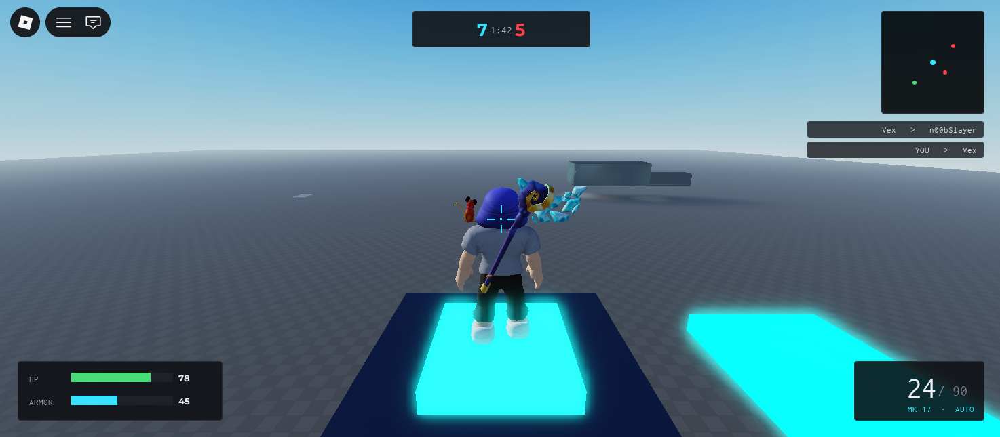
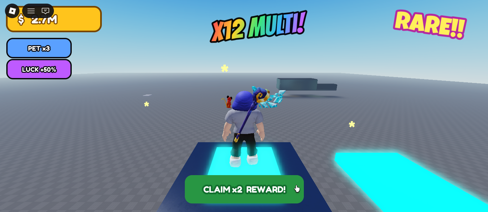
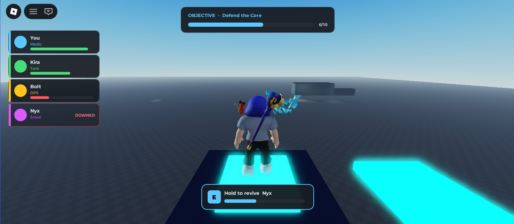
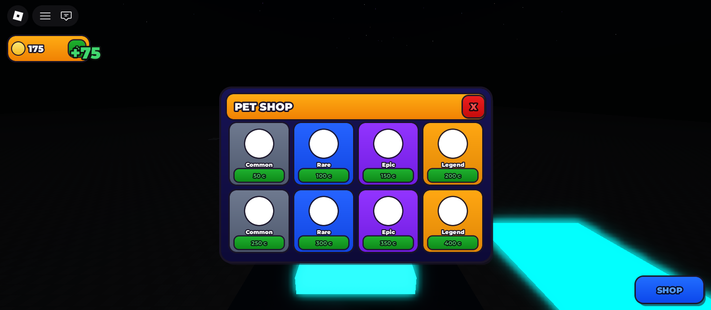

<p align="center">
  <a href="#readme"><b>EN</b></a>  ·  <a href="#-español"><b>ES</b></a>
</p>

<p align="center">
  
</p>

<h1 align="center">BloxLab</h1>

<p align="center">
  <strong>Quality game-building skills for Roblox — as a Claude Code plugin.</strong><br>
  Type one prompt, get a real Roblox game built in your Studio — <strong>without the generic "AI-slop" look</strong>.
</p>

<p align="center">
  
  
  
  
  
  
</p>

> **The engine is solved — taste isn't.** Roblox already ships a first-party AI assistant and an official MCP that can run code, generate meshes/materials, and search assets. What it *can't* do is make the result feel designed. BloxLab is that missing **quality layer**.

---

## Gallery

Real output, built live in Studio through the skills. The point isn't the engine — it's that the result looks **designed**, and the UI is **matched to the genre** instead of one generic "AI" look.

**Worlds — the quality layer**

| Horror | Backrooms | Obby |
|---|---|---|
|  |  |  |

**UI, matched to the genre** (not generic AI UI)

| Playful pet shop | Cold horror dialogue | Competitive FPS HUD |
|---|---|---|
|  |  |  |

| Brainrot HUD | Co-op party frames | Money splash (juice) |
|---|---|---|
|  |  |  |

> Same plugin, six genres. The chunky pet shop, the cold monospace horror box, the angular FPS HUD, and the chaotic brainrot screen are all `game-ui` — it reads the genre first.

---

## Why

Roblox's native AI builder (and its official `Roblox_Studio` MCP) already handle the plumbing — and the generative parts (meshes, materials, 3D models) run in Roblox's cloud, so no third-party tool can beat them there. The gap is **taste**: native output looks generic and templated.

BloxLab doesn't rebuild the engine. It adds per-genre **game-design knowledge** + an **anti-AI-slop checklist** + a build recipe, so what gets built looks intentional, not auto-generated.

```text
You (a prompt in Claude Code)
   → Claude            the brain
   → Roblox_Studio MCP the hands (run code · generate · search assets)
   → BloxLab skills    the taste (how to make it actually good)
   → your open Roblox Studio
```

No API keys required — Claude Code is the brain.

## Requirements

1. **Roblox Studio** with its MCP enabled: *Assistant → MCP Servers → "Enable Studio as MCP server"*, connected to your agent via Quick Connect.
2. **An MCP-capable agent** with the official `Roblox_Studio` MCP connected (the skills call its tools).
3. The skills available to that agent (install or point at them, below).

## Compatibility

BloxLab ships as a **Claude Code plugin**, but it isn't locked to it. The hands are the **official `Roblox_Studio` MCP** — a standard MCP server — and the skills are plain Markdown recipes. So you can use BloxLab from **any MCP-capable agent**: Claude Code, Claude Desktop, Cursor, Codex, and more.

- **Claude Code** — one-command plugin install (below), then `/bloxlab:<skill>`.
- **Other MCP clients (Cursor, Codex, Claude Desktop, ...)** — connect the `Roblox_Studio` MCP and point the agent at the skill you want (`skills/<name>/SKILL.md`). No install step needed to run a recipe.

## Install

**As a Claude Code plugin:**

```text
/plugin marketplace add imhugiok/bloxlab
/plugin install bloxlab@bloxlab
/reload-plugins
```

Local development (from a cloned/working folder):

```text
/plugin marketplace add <path-to-this-folder>
/plugin install bloxlab@bloxlab
/reload-plugins
```

## Usage

Open Roblox Studio on a **test place**, then in Claude Code run any skill:

```text
/bloxlab:horror-map
/bloxlab:backrooms
/bloxlab:obby
```

Every skill **asks what you want first** — then builds and **self-reviews with screenshots** before calling it done.

## How it works

A skill is a recipe Claude follows. Each one:

1. **Asks first (intake)** — never builds blind. You pick: *I have an idea · a theme · brainstorm · surprise me · just testing · plan first*.
2. **Builds with the official MCP** — blockout, atmosphere/systems, detailing, scripts.
3. **Self-reviews** — takes a `screen_capture`, critiques it against the anti-AI-slop checklist, fixes, repeats.

Shared rules live in [`knowledge/`](knowledge/): [`anti-ai-slop.md`](knowledge/anti-ai-slop.md) and [`intake.md`](knowledge/intake.md).

## Skills

**Game modes**

| Skill | Builds |
|---|---|
| `horror-map` | Horror map section with real atmosphere |
| `backrooms` | Liminal, endless, sickly-fluorescent space |
| `obby` | Fair obstacle course with checkpoints |
| `tycoon` | Buy → produce → grow money loop |
| `simulator` | Collect/grind loop, zones, pets (incl. brainrot) |
| `shooter` | Combat map with real flow (+ optional shooting) |
| `tower-defense` | Waves down a path, towers with roles |
| `survival` | Gather / craft / survive, tension-and-relief |
| `racing` | Track with a real layout, laps, checkpoints |
| `roleplay-town` | A town/city that feels lived-in |
| `escape-room` | Fair, chained puzzles |

**Systems (drop into any game)**

| Skill | Adds |
|---|---|
| `game-ui` | HUD / menus / shops / dialogs that don't look generic |
| `key-door-monster` | Objective loop: keys, doors, threat, goal |
| `npc` | NPCs with believable behavior |

## The anti-AI-slop rule

Every skill follows the same quality bar ([full list](knowledge/anti-ai-slop.md)): kill uniformity (no perfect grids), atmosphere before object-count, intentional palette (`Color3`, not default `BrickColor`), human scale, intentional imperfection, sound & motion, and a mandatory screenshot self-review before "done".

## Project structure

```text
.claude-plugin/   plugin.json + marketplace.json
skills/           14 skills → /bloxlab:<name>
knowledge/        anti-ai-slop.md, intake.md (shared rules)
docs/             design notes (quality-layer-plan.md)
```

## Status

Early and in active development. The architecture and recipes are in place; `horror-map`, `backrooms` and `obby` have been battle-tested live in Studio (and the recipes hardened from what broke), the rest are being validated. Honest by design — skills won't fake asset IDs or sounds, and stop safely instead of breaking your scene. Feedback, issues, and PRs welcome — see [CONTRIBUTING.md](CONTRIBUTING.md).

## About

Built by **Hugo Rivera** ([@imhugiok](https://github.com/imhugiok)) — making it easy to build *good* Roblox games with AI. Community, MIT-licensed: use it, fork it, open issues and PRs.

- 🌐 Portfolio **[hugorivera.me](https://hugorivera.me)**
- 📸 Instagram **[@imhugi.ok](https://instagram.com/imhugi.ok)**

## License

[MIT](LICENSE).

---

## 🇪🇸 Español

<p>
  <a href="#readme">EN</a>  ·  <b>ES</b>
</p>

<p>
  <strong>Skills de calidad para construir juegos de Roblox, como plugin de Claude Code.</strong><br>
  Escribe un prompt y obtén un juego de Roblox real construido en tu Studio, <strong>sin el look genérico de "IA".</strong>
</p>

> **El engine está resuelto, el taste no.** Roblox ya trae un asistente de IA propio y un MCP oficial que ejecuta código, genera mallas/materiales y busca assets. Lo que *no* sabe hacer es que el resultado se vea diseñado. BloxLab es esa **capa de calidad** que falta.

---

## Galería

Output real, construido en vivo en Studio a través de los skills. El punto no es el engine, es que el resultado se ve **diseñado**, y la UI está **adaptada al género** en lugar de un único look genérico de "IA".

**Mundos: la capa de calidad**

| Terror | Backrooms | Obby |
|---|---|---|
|  |  |  |

**UI adaptada al género** (no UI genérica de IA)

| Tienda de mascotas juguetona | Diálogo de terror frío | HUD de FPS competitivo |
|---|---|---|
|  |  |  |

| HUD brainrot | Party frames cooperativo | Splash de dinero (juice) |
|---|---|---|
|  |  |  |

> El mismo plugin, seis géneros. La tienda chunky, la caja de terror monospace fría, el HUD angular de FPS y la pantalla caótica de brainrot son todos `game-ui`: lee el género primero.

---

## Por qué

El constructor de IA nativo de Roblox (y su MCP oficial `Roblox_Studio`) ya resuelven la plomería, y las partes generativas (mallas, materiales, modelos 3D) corren en la nube de Roblox, así que ninguna herramienta de terceros les gana ahí. La brecha es el **taste**: el output nativo se ve genérico y de plantilla.

BloxLab no reconstruye el engine. Agrega **conocimiento de game design por género** + un **checklist anti-AI-slop** + una receta de construcción, para que lo que se construye se vea intencional, no autogenerado.

```text
Tú (un prompt en Claude Code)
   → Claude            el cerebro
   → MCP Roblox_Studio las manos (ejecuta código · genera · busca assets)
   → skills de BloxLab el taste (cómo hacerlo realmente bueno)
   → tu Roblox Studio abierto
```

Sin API keys: el cerebro es Claude Code.

## Requisitos

1. **Roblox Studio** con su MCP activado: *Assistant → MCP Servers → "Enable Studio as MCP server"*, conectado a tu agente vía Quick Connect.
2. **Un agente compatible con MCP** con el MCP oficial `Roblox_Studio` conectado (los skills llaman a sus tools).
3. Los skills disponibles para ese agente (instálalos o apúntalo a ellos, abajo).

## Compatibilidad

BloxLab se distribuye como **plugin de Claude Code**, pero no está atado a él. Las manos son el **MCP oficial `Roblox_Studio`** (un servidor MCP estándar) y los skills son recetas en Markdown. Así que puedes usar BloxLab desde **cualquier agente compatible con MCP**: Claude Code, Claude Desktop, Cursor, Codex y más.

- **Claude Code** — instalación del plugin en un comando (abajo), luego `/bloxlab:<skill>`.
- **Otros clientes MCP (Cursor, Codex, Claude Desktop, ...)** — conecta el MCP `Roblox_Studio` y apunta el agente al skill que quieras (`skills/<nombre>/SKILL.md`). No hace falta instalar nada para correr una receta.

## Instalar

**Como plugin de Claude Code:**

```text
/plugin marketplace add imhugiok/bloxlab
/plugin install bloxlab@bloxlab
/reload-plugins
```

Desarrollo local (desde una carpeta clonada o de trabajo):

```text
/plugin marketplace add <ruta-a-esta-carpeta>
/plugin install bloxlab@bloxlab
/reload-plugins
```

## Uso

Abre Roblox Studio en un **lugar de prueba**, y en Claude Code corre cualquier skill:

```text
/bloxlab:horror-map
/bloxlab:backrooms
/bloxlab:obby
```

Cada skill **pregunta primero qué quieres**, y luego construye y **se autorrevisa con capturas** antes de darse por terminado.

## Cómo funciona

Un skill es una receta que Claude sigue. Cada uno:

1. **Pregunta primero (intake)**: nunca construye a ciegas. Tú eliges: *ya tengo una idea · un tema · lluvia de ideas · sorpréndeme · solo probando · planear primero*.
2. **Construye con el MCP oficial**: blockout, atmósfera/sistemas, detallado, scripts.
3. **Se autorrevisa**: toma un `screen_capture`, lo critica contra el checklist anti-AI-slop, corrige, repite.

Las reglas compartidas viven en [`knowledge/`](knowledge/): [`anti-ai-slop.md`](knowledge/anti-ai-slop.md) e [`intake.md`](knowledge/intake.md).

## Skills

**Modos de juego**

| Skill | Construye |
|---|---|
| `horror-map` | Sección de mapa de terror con atmósfera real |
| `backrooms` | Espacio liminal, infinito, de fluorescente enfermizo |
| `obby` | Carrera de obstáculos justa con checkpoints |
| `tycoon` | Bucle comprar → producir → crecer dinero |
| `simulator` | Bucle de recolectar/grindear, zonas, mascotas (incl. brainrot) |
| `shooter` | Mapa de combate con flujo real (+ disparo opcional) |
| `tower-defense` | Oleadas por un camino, torres con roles |
| `survival` | Recolectar / craftear / sobrevivir, tensión y alivio |
| `racing` | Pista con trazado real, vueltas, checkpoints |
| `roleplay-town` | Un pueblo/ciudad que se siente habitado |
| `escape-room` | Puzzles justos y encadenados |

**Sistemas (para cualquier juego)**

| Skill | Agrega |
|---|---|
| `game-ui` | HUD / menús / tiendas / diálogos que no se ven genéricos |
| `key-door-monster` | Bucle de objetivo: llaves, puertas, amenaza, meta |
| `npc` | NPCs con comportamiento creíble |

## La regla anti-AI-slop

Cada skill sigue la misma barra de calidad ([lista completa](knowledge/anti-ai-slop.md)): matar la uniformidad (nada de grids perfectos), atmósfera antes que cantidad de objetos, paleta intencional (`Color3`, no el `BrickColor` por defecto), escala humana, imperfección intencional, sonido y movimiento, y una autorrevisión obligatoria con captura antes de "listo".

## Estructura del proyecto

```text
.claude-plugin/   plugin.json + marketplace.json
skills/           14 skills → /bloxlab:<nombre>
knowledge/        anti-ai-slop.md, intake.md (reglas compartidas)
docs/             notas de diseño (quality-layer-plan.md)
```

## Estado

Temprano y en desarrollo activo. La arquitectura y las recetas están en su lugar; `horror-map`, `backrooms` y `obby` se han probado en vivo en Studio (y las recetas se endurecieron con lo que se rompió), el resto se está validando. Honesto por diseño: los skills no inventan IDs de assets ni sonidos, y se detienen de forma segura en vez de romper tu escena. Feedback, issues y PRs bienvenidos, ve [CONTRIBUTING.md](CONTRIBUTING.md).

## Acerca de

Hecho por **Hugo Rivera** ([@imhugiok](https://github.com/imhugiok)): haciendo fácil construir *buenos* juegos de Roblox con IA. Comunitario, con licencia MIT: úsalo, hazle fork, abre issues y PRs.

- 🌐 Portafolio **[hugorivera.me](https://hugorivera.me)**
- 📸 Instagram **[@imhugi.ok](https://instagram.com/imhugi.ok)**

## Licencia

[MIT](LICENSE).
